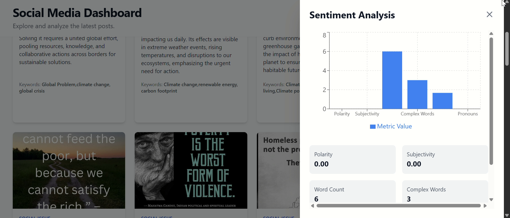

# Sentiment-Analysis-Web-Application-using-Streamlit
Streamlit tool for sentiment analysis on text/images with visualizations. Uses pytesseract and newspaper3k.

Developer : KeerthiKeswaran

The Sentiment Analysis-NLP Tool is a web application built using Newspaper3k and Pytesseract, designed to analyze sentiment in textual content. The tool incorporates various functionalities to facilitate sentiment analysis on both text and images.


# Social Media Sentiment Analysis — Setup Guide

This project consists of two main parts:

- **Server:** FastAPI backend for sentiment analysis  
- **Client:** React + TypeScript + Vite frontend dashboard  

---

## 1. Server Setup (FastAPI)

### 1.1 Navigate to the server directory
```bash
cd server
```

### 1.2 Create and activate a virtual environment
```bash
python -m venv venv
```

Activate it:
Windows (PowerShell):
```bash
.\venv\Scripts\Activate
```

macOS/Linux:

```bash
source venv/bin/activate
```

1.3 Install dependencies
```bash
pip install -r requirements.txt
```

1.4 Run the FastAPI server
```bash
uvicorn main:app --reload
```

The API will be available at:
```bash
http://127.0.0.1:8000
```

Interactive API documentation:
```bash
http://127.0.0.1:8000/docs
```

2. Client Setup (React + Vite)
2.1 Navigate to the client directory
```bash
cd client
```

2.2 Install dependencies
```bash
npm install
```

If you encounter compatibility issues, use Node.js v20 (LTS):

```bash
nvm install 20
nvm use 20
node -v
```

2.3 Start the development server
```bash
npm run dev
```

The frontend will be available at:
```bash
http://localhost:5173
```

3. Connecting Frontend and Backend
The client is configured to connect to the backend running at:
```bash
http://127.0.0.1:8000
```

If your backend runs on a different host or port, update the base API URL in:
```bash
/client/src/utils/api.ts
```


### Latest Snapshot:





## Streamlit app:


**Key Features:**

1. **Search and Keyword Selection:** Users can input a search term or choose from a list of recommended keywords related to various topics such as climate, global issues, mental health, etc.

2. **Data Retrieval:** The tool retrieves relevant articles from a dataset stored in an Excel sheet (Lesser for now), filtering them based on the selected search term or keyword.


3. **Text Extraction from Images:** For articles that contain images, the tool utilizes pytesseract to extract text from the images, enabling sentiment analysis even on image-based content.

4. **Web Scraping for Textual Content:** For articles stored as webpages, the tool employs the newspaper3k library for web scraping, extracting the article's text for sentiment analysis.

5. **Sentiment Analysis Metrics:** The sentiment analysis includes metrics such as polarity (positive or negative sentiment), subjectivity (opinion vs. factual information), word count, complexity of words, syllables per word, and count of personal pronouns.

6. **Interactive Interface:** Users can interact with the tool through a user-friendly interface, where each analyzed article is presented along with its metadata and a button to initiate sentiment analysis.

7. **Data Visualization:** The sentiment analysis results are displayed in a bar chart format, providing a visual representation of the sentiment metrics for better interpretation.


**How to Use:**

- Select a search term or choose from recommended keywords.
- View filtered articles from the dataset based on the selected term.
- Click on the "Analyse" button next to each article to perform sentiment analysis.
- Analyze sentiment metrics such as polarity, subjectivity, word count, complexity, syllables per word, and personal pronouns count.
- Visualize sentiment analysis results using interactive bar charts.

**Applications:**

- **Content Analysis:** Analyze sentiment in news articles, blog posts, or social media content.
- **Research:** Conduct sentiment analysis for academic or research purposes on specific topics.
- **Decision Support:** Gain insights into public opinion or sentiment trends related to various subjects.
- **Educational Tool:** Learn about sentiment analysis techniques and NLP applications in a practical setting.

The Sentiment Analysis-NLP Tool offers a versatile and intuitive platform for exploring sentiment analysis on textual and image-based content, empowering users to extract valuable insights from diverse sources of information.

